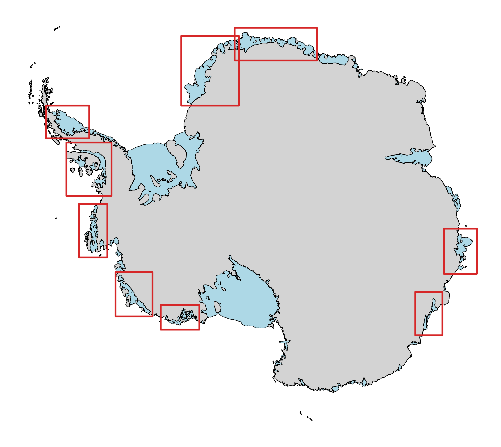
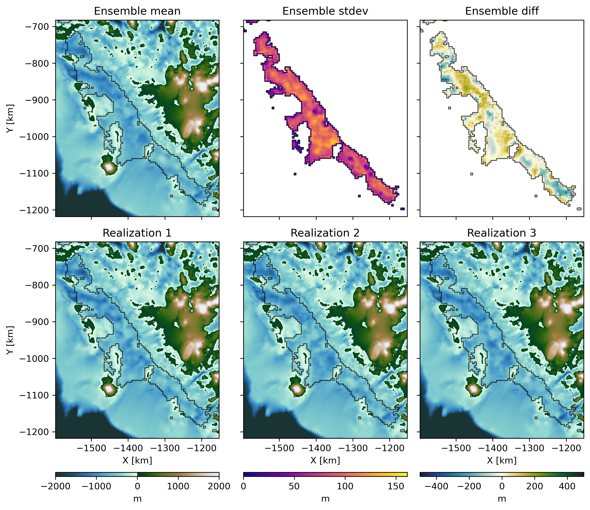

## Stochastic inversion of sub-ice-shelf bathymetry around Antarctica

Authors: Michael Field, Emma (Mickey) MacKie, Lijing Wang, Atsuhiro Muto, Niya Shao

### Overview

The shape of the seafloor, or bathymetry, below ice shelves is a critical uncertainty in ice sheet models and the sea level rise that they predict. Sub-ice-shelf bathymetry is hard to measure, and the best way to do it on large spatial scales is with airborne gravity measurements. Previous gravity inversions of sub-ice-shelf bathymetry have been deterministic, meaning they produce a single output that is the same all the time, and have not robustly quantified the uncertainty of the bathymetry due to different sources. The goal of this work is to create a stochastic inversion process that produces different realizations of sub-ice-shelf bathymetry. The ensemble of realizations are then used to measure the uncertainty of the bathymetry. The driver of the uncertainty is the interpolation of the Bouguer disturbance, which represents crustal density variations and crustal thickness. Previous inverions have deterministically interpolated the Bouger disturbance, leading to a single deterministic inversions. Instead, we use Sequential Gaussian Simulation (SGS) to stochastically interpolate the Bouguer disturbance. We produced bathymetry ensembles for 9 ice shelves/regions around Antarctica: Abbot, George VI, Getz, Larsen, Queen Maud Land east, Queen Maud Land west, Salzberger, Shackleton, and Totten and Moscow University. 

	
	

### Environment

In order to reproduce this work it is *highly* recommended you create a conda environment using the provided `environment.yml`. The environemnt can be created using:

`conda env create -f environment.yml`

The environment can then be activated with

`conda activate cryo`

### Usage

In order to reproduce the results in the (upcoming) paper:

1. Download data from the sources listed below and put them in `raw_data/`.
2. Run the preprocessing notebooks for each ice shelf in the `iceshelves/` folder.
3. Test out inversions in `*_inv_test.ipynb` notebooks for each ice shelf. Inversions parameters, particularly the block update parameters, can be experimented with in this notebook.
4. To reproduce the ensembles as presented in the manuscript you can run `run_inversions.sh` which runs the inversion script for each ice shelf found in its folder. You can specify the number of inversions (-n) and whether or not to apply a lowpass filter to the Bouguer disturbance (-f) for the inverion scripts.
6. The figures from the paper and more can be reproduced by running `figures.iypnb` and `intro_fig.ipynb`.

**Note**: Following these steps and reproducing the ensembles shown in the paper takes about 32 hours on a 11th Gen Intel(R) Core(TM) i7-11700 @ 2.50GHz with 64 GB RAM

### Data

This work uses a number of data sources:
* **AntGG2021**
  Scheinert, Mirko; Zingerle, Philipp; Schaller, Theresa; Pail, Roland (2024): Antarctic gravity anomaly and height anomaly grids (AntGG2021) [dataset]. PANGAEA, https://doi.org/10.1594/PANGAEA.971238
* **BedMachine Antarctica v3**  
  Morlighem, M. (2022). MEaSUREs BedMachine Antarctica. (NSIDC-0756, Version 3). [Data Set]. Boulder, Colorado USA. NASA National Snow and Ice Data Center Distributed Active Archive Center. https://doi.org/10.5067/FPSU0V1MWUB6. Date Accessed 01-20-2025.
* **MOA2014**  
  Haran, T., Klinger, M., Bohlander, J., Fahnestock, M., Painter, T. & Scambos, T. (2018). MEaSUREs MODIS Mosaic of Antarctica 2013-2014 (MOA2014) Image Map. (NSIDC-0730, Version 1). [Data Set]. Boulder, Colorado USA. NASA National Snow and Ice Data Center Distributed Active Archive Center. https://doi.org/10.5067/RNF17BP824UM. Date Accessed 01-20-2025.
* **Phase Velocity**  
  Mouginot, J., Rignot, E. & Scheuchl, B. (2019). MEaSUREs Phase-Based Antarctica Ice Velocity Map. (NSIDC-0754, Version 1). [Data Set]. Boulder, Colorado USA. NASA National Snow and Ice Data Center Distributed Active Archive Center. https://doi.org/10.5067/PZ3NJ5RXRH10. Date Accessed 01-20-2025.
* **Grounding Zone**  
  Rignot, E., Mouginot, J. & Scheuchl, B. (2023). MEaSUREs Grounding Zone of the Antarctic Ice Sheet. (NSIDC-0778, Version 1). [Data Set]. Boulder, Colorado USA. NASA National Snow and Ice Data Center Distributed Active Archive Center. https://doi.org/10.5067/HGLT8XB480E4. Date Accessed 01-20-2025.
* **Thwaites and Dotson seismic sounding**  
  Muto, A., Alley, K., Pettit, E. C., Pomraning, D., Roccaro, A., Scambos, T., et al. (2024) "Sub-ice-shelf seafloor elevation derived from point-source active-seismic data on Thwaites Eastern Ice Shelf and Dotson Ice Shelf, December 2019 and January 2020" U.S. Antarctic Program (USAP) Data Center. doi: https://doi.org/10.15784/601827.

### Software

* **Harmonica**
  Fatiando a Terra Project, Castro, Y. M., Esteban, F. D., Li, L., Oliveira Jr, V. C., Pesce, A., Shea, N., Soler, S. R., Souza-Junior, G. F., Tankersley, M., Uieda, L., & Uppal, I. (2024). Harmonica v0.7.0: Forward modeling, inversion, and processing gravity and magnetic data (0.7.0). Zenodo. https://doi.org/10.5281/zenodo.13308312
* **Gradient Boosted Equivalent Sources (Harmonica)**  
  Santiago R Soler, Leonardo Uieda, Gradient-boosted equivalent sources, Geophysical Journal International, Volume 227, Issue 3, December 2021, Pages 1768–1783, https://doi.org/10.1093/gji/ggab297
* **Verde**  
  Uieda, L. (2018). Verde: Processing and gridding spatial data using Green’s functions. Journal of Open Source Software, 3(29), 957. doi:10.21105/joss.00957
* **SciKit Gstat**  
  Mirko Mälicke, Egil Möller, Helge David Schneider, & Sebastian Müller. (2021, May 28). mmaelicke/scikit-gstat: A scipy flavoured geostatistical variogram analysis toolbox (Version v0.6.0). Zenodo. http://doi.org/10.5281/zenodo.4835779
* **GSTools**  
  Sebastian Müller, & Lennart Schüler. (2023). GeoStat-Framework/GSTools: v1.5.0 'Nifty Neon' (v1.5.0). Zenodo. https://doi.org/10.5281/zenodo.8044720

